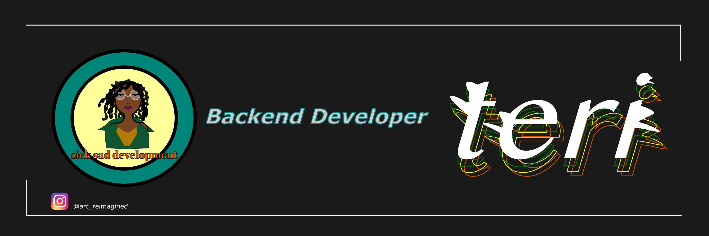
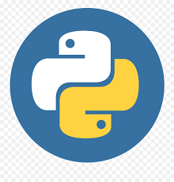
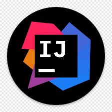

 

### Hello world! I'm Teri. 👋🏿

I grew up in Harlem, New York but currently live in Georgia. I'm an artist/designer and a developer.

 

### Languages and Tools:

 
 

:zap: GitHub Stats

Here are some ideas to get you started:

- 🔭 I’m currently working on ...
- 🌱 I’m currently learning ...
- 👯 I’m looking to collaborate on ...
- 🤔 I’m looking for help with ...
- 💬 Ask me about ...
- 📫 How to reach me: ...
- 😄 Pronouns: ...
- ⚡ Fun fact: ...
  -->

### Let's connect:

 
 
