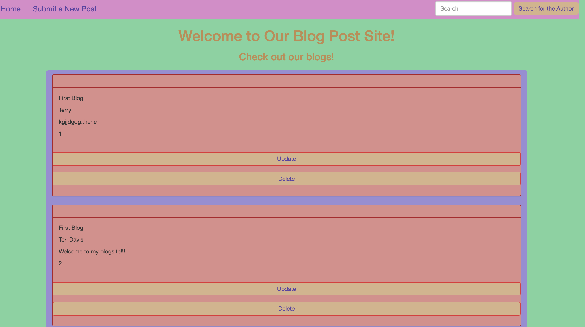

 

### Hello world! I'm Teri. 👋🏿

I grew up in Harlem, New York but currently live in Georgia. I'm an artist/designer and a developer.

 

### Languages and Tools:

 
 

### Projects
## BlogPost Project

A blogpost CRUD application with persistent data.

<b>JAVA, HTML/CSS, THYMELEAF, H2 DATABASE</b>

<a class="project-link" target="_blank" href="https://github.com/artreimagined/techtalentblog.git">View Code</a>

       
            
 
 

:zap: GitHub Stats

### Let's connect:

 
 
